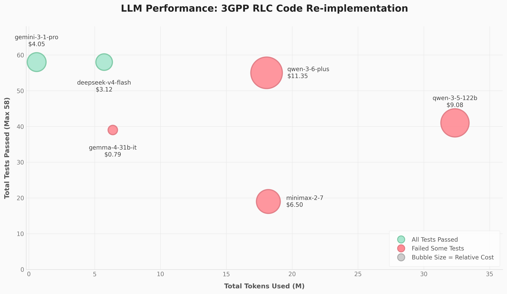

# 🤖 LLM 5G Protocol Stack Re-implementation Experiment

Can a Large Language Model implement a 5G protocol stack layer entirely from 3GPP specifications?

I recently conducted an experiment to evaluate the software engineering capabilities of modern LLMs within the telecommunications domain. The objective was to determine how effectively different models could re-implement the 3GPP RLC (Radio Link Control) layer.

## 🧪 The Methodology

1. **Started with srsRAN_Project:** Began with the open-source srsRAN_Project (a 5G RAN protocol stack).
2. **Created prompts:** Created a set of prompt instructions within the `lib/rlc` directory.
3. **Wiped the slate clean:** Removed all original source code to provide a blank slate (utilising a clean `rlc_llm_startpoint` branch).
4. **Provided specs and tests:** Supplied the models with the formal 3GPP RLC specification (`ts_138322v150500p.pdf`) alongside existing test cases.
5. **Executed:** Tasked the models with autonomously rebuilding the RLC layer.

## 📊 The Findings

The models were evaluated on total tests passed (maximum 58), token utilisation, and overall cost.

* **🏆 Top Tier (Passed All 58 Tests):** Only two models successfully navigated every test case: Gemini-3.1-Pro and DeepSeek-V4-Flash.
* **⚡ Most Efficient:** Gemini-3.1-Pro achieved a flawless score whilst remaining highly token-efficient (utilising fewer than 1 million tokens) at a modest cost of $4.05.
* **💰 Most Cost-Effective:** DeepSeek-V4-Flash also attained a 58/58 score and proved the most economical at just $3.12, although it required significantly more iterative token usage (~6M tokens) to achieve this.
* **📉 The Remainder:** Other models, such as the Qwen variants, struggled. They consumed substantial token volumes (18M to over 32M), incurred higher costs, and ultimately failed to pass the complete test suite.

## 🧠 Problem-Solving Approaches

Observing the models' workflows revealed distinct methodological differences, generally falling into two categories:

* **The "First-Principles Planners" (Gemini):** Relied heavily on upfront reading and planning. Rather than immediately generating code to see what failed, Gemini parsed the 3GPP specifications, mapped the project structure, and implemented the complex bit-shifting logic correctly on the first few attempts. It internalised the requirements prior to execution.
* **The "Iterative Problem-Solvers" (DeepSeek, Qwen, MiniMax):** Adopted a rapid trial-and-error methodology. They generated an initial implementation, executed the C++ unit tests, analysed the crash logs, and attempted to resolve isolated errors. Whilst DeepSeek successfully iterated its way to a perfect score, others became caught in developmental loops—expending tens of millions of tokens patching edge cases without fully comprehending the underlying binary packet specifications.

## 💡 Reflections & Critical Caveat

This experiment underscores the current frontier of AI in telecommunications software engineering. We are steadily approaching a point where capable LLMs can reliably translate dense, complex 3GPP standards directly into functional, verified code.

**⚠️ A Critical Caveat:**
Whilst AI is a powerful tool, it requires strict parameters to function correctly. The success of these models relied entirely upon three human-driven factors:
1. High-quality documentation (the precise 3GPP specifications).
2. A well-defined architecture (the existing srsRAN framework).
3. Crucially, comprehensive test cases for validation.

Without rigorous unit tests to serve as the ultimate ground truth and identify edge cases, even the most advanced LLM will confidently produce flawed code. Robust testing frameworks are more essential now than ever.

---

## 🔍 Deep Dive: Model Chat Logs & Performance

For those interested in the precise figures and how each model approached the prompt, here is a summary derived from their chat logs:

### 🥇 1. Gemini 3.1 Pro (`gemini-3-1-pro`)
* **Results:** 14/14 UM Tests, 44/44 AM Tests (Total: 58/58)
* **Tokens:** ~22K In | ~574K Out
* **Cost:** $4.05
* **Summary:** Highly efficient. It methodically generated a comprehensive execution plan based on the prompts. It appeared to internalise the 3GPP specification immediately, resulting in minimal token usage and a perfect pass rate.

### 🥈 2. DeepSeek v4 Flash (`deepseek-v4-flash`)
* **Results:** 14/14 UM Tests, 44/44 AM Tests (Total: 58/58)
* **Tokens:** ~322K In | ~5.4M Out
* **Cost:** $3.12
* **Summary:** The most cost-effective. It relied heavily upon reviewing C++ test error outputs and adjusting its implementations based on explicit test expectations. It required greater token expenditure to adjust headers and bitwise operations, but its low cost-per-token ratio renders it highly viable.

### 🥉 3. Qwen 3.6 Plus (`qwen-3-6-plus`)
* **Results:** 14/14 UM Tests, 41/44 AM Tests (Total: 55/58)
* **Tokens:** ~460K In | ~17.6M Out
* **Cost:** $11.35
* **Summary:** A commendable effort, but it struggled significantly with edge cases. It easily passed the UM PDU tests but encountered immense difficulty with the complexity of 18-bit Sequence Number logic and Status PDU packing/unpacking in Acknowledged Mode (AM).

### 📉 4. Qwen 3.5 122B (`qwen-3-5-122b`)
* **Results:** 14/14 UM Tests, 27/44 AM Tests (Total: 41/58)
* **Tokens:** ~368K In | ~32M Out
* **Cost:** $9.08
* **Summary:** Expended an enormous volume of tokens with little progress. It encountered an early obstacle parsing 12-bit SN segmented PDUs and demonstrated fundamental difficulties in understanding how 3GPP expects bits to be packed across byte boundaries.

### 📉 5. Gemma 4 31B IT (`gemma-4-31b-it`)
* **Results:** 14/14 UM Tests, 25/44 AM Tests (Total: 39/58)
* **Tokens:** ~6.3M In | ~79.1K Out
* **Cost:** $0.79
* **Summary:** Processed a substantial amount of context but produced minimal code. It correctly implemented the basic UM headers but failed to comprehend the complexity of the AM status reports and segmentations.

### 📉 6. MiniMax 2.7 (`minimax-2-7`)
* **Results:** 12/14 UM Tests, 7/44 AM Tests (Total: 19/58)
* **Tokens:** ~194K In | ~18M Out
* **Cost:** $6.50
* **Summary:** Adopted a rapid "stubbing" approach, generating placeholder files quickly but failing to deliver the actual protocol implementation. It became trapped in loops of failed test runs without identifying the root cause of its bitfield errors.